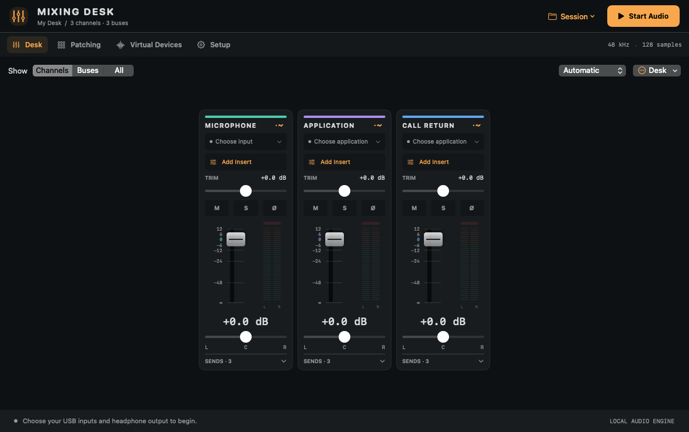
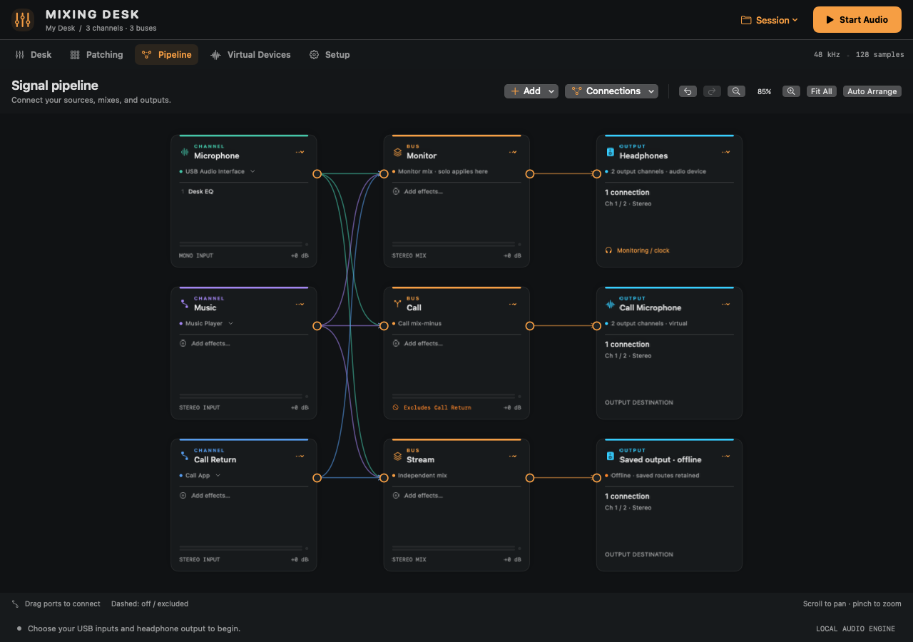

# Mixing Desk

A native Mac audio mixer for your microphone, audio interface, and application audio. Make independent headphone, call, stream, and recording mixes, with EQ and installed AUv2/VST3 effects.

**Experimental beta · Apple Silicon · macOS 14.4+ · 48 kHz**

The first installable beta is being prepared. Public downloads will appear in [GitHub Releases](https://github.com/killerfridge/mixing-desk/releases) after the [release checks](docs/RELEASE_CHECKLIST.md) pass. Source builds are available now. This is a community project with best-effort support.



## Install

1. Download the combined `MixingDesk-<version>-arm64.pkg` from the release page. Read its release notes and [installation guide](docs/INSTALL.md).
2. Quit Mixing Desk if it is running. Closing the window leaves its menu-bar mixer active.
3. Open the installer. It installs the app in **Applications**. Select the optional **Mixing Desk Audio** component if you want virtual microphone or recording devices for other apps. This option starts unchecked.
4. Restart your Mac if you installed or replaced the driver, then open Mixing Desk from Applications.

These experimental downloads use ad-hoc code signatures and are **not notarized by Apple**. macOS can block the installer or app until you explicitly approve it in Privacy & Security. Managed Macs may prevent this. We do not provide scripts to disable Gatekeeper or remove quarantine. Follow [Apple’s guidance](https://support.apple.com/en-ie/102445) only if you trust the download. The fresh-Mac approval path remains a release acceptance check, not a claim established by local builds.

## Make your first mix

The setup guide helps you choose an output and sources. Nothing is assigned to a particular audio device or call app by default, and audio starts only when you choose **Start Audio**.

- Choose headphones or an interface supporting 48 kHz. The selected output supplies the mix’s clock; it never silently switches to another output.
- Assign Microphone, Application, and Call Return as needed. Play audio in an app to make it appear in the list. Its normal playback is muted while the desk captures it.
- For calls, create a stereo **Desk Call** in Virtual Devices, patch the Call bus to it in Patching, and select it as the microphone in your call app. Call Return is excluded from the Call bus by default.
- Add instrument channels using **Desk → Add Channel** and select their input channels in Channel Settings. Avoid hearing the same source through both interface direct monitoring and the desk.

See the [illustrated quick start](docs/QUICK_START.md), [technical reference](docs/REFERENCE.md), and [compatibility/validation record](docs/VALIDATION.md).

## Route visually with Pipeline

The new **Pipeline** tab adds an editable graph alongside Desk and Patching. Drag connections between channels, buses, and outputs; inspect a cable to set its level and output channels. Move blocks, pan and zoom, or use the connection menus and routing undo/redo. Pipeline and Patching share the same session.



Read the [Pipeline routing guide](docs/PIPELINE.md). This feature is on the development branch; the existing `v0.5.0-beta.1` tag and draft downloads are unchanged.

## Level and meter controls

Channel and final-output protection default to −1 dBFS sample-peak limiting, with short lookahead adding **96 samples / 2 ms**, including during bypass. Amber **LIMIT** shows gain reduction; the output indicator names affected destinations. Protection cannot repair input/plugin distortion or guarantee intersample true peaks.

Click trim, fader, or bus-level readouts to enter exact levels; hold Shift while dragging for fine adjustment. **Solo: N · Clear** and **⇧⌘L** clear all monitor solos. Click any channel/bus meter to reset its held dBFS peak and overload latch, or use **Reset All Meters**. Desk and Pipeline share these controls. See the [technical reference](docs/REFERENCE.md#automatic-overload-protection-and-meters).

## What the beta supports

Hardware and application sources, separate buses, mix-minus, direct recording outputs, persistent named virtual devices, a built-in three-band EQ, and up to four ordered inserts per channel or bus. Sessions and presets are portable versioned JSON; unavailable bindings remain offline.

Current limits include Apple Silicon only, 48 kHz mono/stereo effects, VST3 parameter editors rather than vendor windows, no parallel-path delay compensation, and sample-peak protection rather than true-peak mastering protection. Active plugins run in the app and can crash or hang it. A bus hosting AUv2/VST3 effects cannot send to another bus. AUv3, VST2, instruments, MIDI, and sidechains are not supported. See [beta release notes](docs/releases/0.5.0-beta.1.md).

## Privacy and support

Mixing Desk has no accounts, telemetry, or automatic update requests. Audio is processed locally; the app does not record audio files or upload audio. Routing to another application lets that application process, record, or transmit it. Installed plugins have their own privacy and licensing behaviour. Sessions live in `~/Library/Application Support/Mixing Desk/`. See [privacy details](docs/PRIVACY.md).

Report reproducible problems through [GitHub Issues](https://github.com/killerfridge/mixing-desk/issues). Review session files and logs before attaching them: device IDs, application IDs, and opaque plugin state can be personal. No response-time or production-use guarantee is offered.

## Build and contribute

```sh
./scripts/build.sh
open 'build/Mixing Desk.app'
```

Apple Command Line Tools are sufficient for the script build. Full Xcode is needed for Xcode builds and XCTest. No dependency downloads or vendor accounts are required for the synthetic tests. Read [CONTRIBUTING](CONTRIBUTING.md) for builds, tests, and release packaging.

## Licence

[MIT](LICENSE). Copyright 2026 Daniel Russell-Brain (killerfridge). Vendored Steinberg interface source has its own [MIT notice](Sources/DeskAudio/VST3SDK/pluginterfaces/LICENSE.txt), included in app builds. Third-party plugins and BlackHole are not distributed with Mixing Desk.
