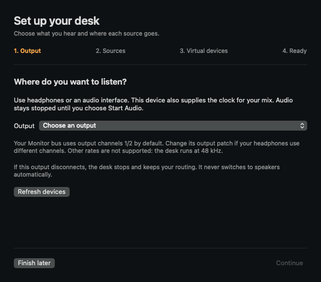

# First mix

## 1. Choose an output

Open Mixing Desk and follow the setup guide. Choose headphones or an audio interface that supports 48 kHz. The Monitor bus initially routes to channels 1/2 (channel 1 on a mono output); use Patching if your headphone output has another mapping. Audio stays stopped until you explicitly start it.

You can reopen this guide from Setup or the Mixing Desk menu while audio is stopped. Opening an existing saved session does not replace its channels or routes with the starter desk.

## 2. Assign sources

Assign a microphone, an application, and a call return as needed. Leave unused sources unassigned. Applications appear after creating an audio stream. Select each application only once; captured playback is heard through your Monitor bus rather than its normal output.

For an instrument, choose Desk → Add Channel. In Channel Settings, choose the interface and actual input channel(s). Mark its role Guitar only if you want Direct Guitar Monitoring to omit it from software monitoring. For the Quad Cortex, select the wet or dry USB channels in your hardware preset; for a RØDE VideoMic GO II, use its microphone input channel. These are examples, not required hardware.

## 3. Start and listen

Start with a low headphone level, choose Start Audio, and approve the requested microphone/system-audio access. If denied, open Privacy & Security and enable Mixing Desk for Microphone and Screen & System Audio Recording (names vary by macOS). Try Start Audio again after changing permissions; quit/reopen if macOS requires it.

Use Mixer Monitoring with duplicate direct monitoring disabled on your interface. Direct Guitar Monitoring is for hearing Guitar-role strips through the interface while their call/stream/record feeds remain active. Channel and final-output protection are enabled by default. Amber LIMIT shows successful gain reduction; red overload indicators latch separately. Protection adds 2 ms and cannot repair input or plugin distortion. Click a meter to reset its held dBFS peak.

## 4. Feed a call or stream

If the optional driver is ready, create a stereo Desk Call in Virtual Devices. In Patching, add an output patch from the Call bus to Desk Call channels 1/2. Choose Desk Call as your call app’s microphone. Assign that app to Call Return; the Call bus excludes it by default. Repeat with Stream/Desk Stream for streaming.

For recording, create a multichannel device and patch direct strip outputs to distinct channel pairs. Never capture an app through both an application tap and a virtual return. Device creation is explicit; the setup guide does not install a driver or create devices automatically.

## 5. Save and stop

Prefer a visual patch bay? Open **Pipeline** to connect the same channels, buses, and output devices by dragging cables or using **Connect to…**. See the [Pipeline guide](PIPELINE.md) for channel mapping, mix-minus highlighting, and undo.

The last valid session is autosaved. Export Session makes a separate backup. Closing the window leaves audio running in the menu bar; Stop Audio or Quit ends it. Opening a saved session stops audio until you choose Start Audio again.

Click level readouts in Desk or Pipeline for exact numeric entry; hold Shift while dragging for fine adjustment. **Solo: N · Clear** or **⇧⌘L** clears all monitor solos. **Desk → Reset All Meters** resets all held peaks and overload indicators.
